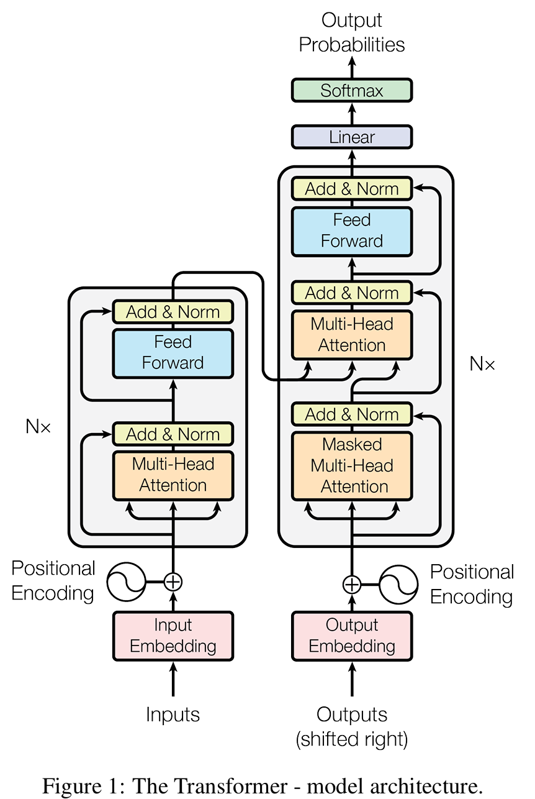

# Transformer 模型详解

Transformer 模型是近年来自然语言处理领域最重要的突破之一，它彻底改变了序列建模的方式。本文将深入解析 Transformer 的核心原理和架构设计。


## 自注意力机制

自注意力机制是 Transformer 的核心，它允许模型在处理序列时关注到序列中的其他位置。

### 缩放点积注意力

```python
import torch
import torch.nn.functional as F

def scaled_dot_product_attention(query, key, value, mask=None):
    """缩放点积注意力实现"""
    d_k = query.size(-1)
    scores = torch.matmul(query, key.transpose(-2, -1)) / math.sqrt(d_k)

    if mask is not None:
        scores = scores.masked_fill(mask == 0, -1e9)

    attention_weights = F.softmax(scores, dim=-1)
    output = torch.matmul(attention_weights, value)

    return output, attention_weights
```

### 多头注意力

多头注意力通过并行运行多个注意力头来捕捉不同类型的信息：

```python
class MultiHeadAttention(nn.Module):
    def __init__(self, d_model, num_heads):
        super().__init__()
        self.num_heads = num_heads
        self.d_model = d_model
        assert d_model % num_heads == 0

        self.depth = d_model // num_heads
        self.wq = nn.Linear(d_model, d_model)
        self.wk = nn.Linear(d_model, d_model)
        self.wv = nn.Linear(d_model, d_model)
        self.dense = nn.Linear(d_model, d_model)

    def split_heads(self, x, batch_size):
        x = x.view(batch_size, -1, self.num_heads, self.depth)
        return x.transpose(1, 2)

    def forward(self, q, k, v, mask):
        batch_size = q.size(0)

        q = self.split_heads(self.wq(q), batch_size)
        k = self.split_heads(self.wk(k), batch_size)
        v = self.split_heads(self.wv(v), batch_size)

        scaled_attention, attention_weights = scaled_dot_product_attention(
            q, k, v, mask
        )

        scaled_attention = scaled_attention.transpose(1, 2).contiguous().view(
            batch_size, -1, self.d_model
        )

        output = self.dense(scaled_attention)
        return output, attention_weights
```

## 位置编码

由于 Transformer 不包含循环或卷积结构，需要位置编码来提供序列的位置信息：

$$PE_{(pos,2i)} = \sin\left(\frac{pos}{10000^{2i/d_{model}}}\right)$$

$$PE_{(pos,2i+1)} = \cos\left(\frac{pos}{10000^{2i/d_{model}}}\right)$$

## 编码器-解码器架构

Transformer 采用编码器-解码器架构：

- **编码器**：由 N 个相同的层组成，每层包含多头自注意力和前馈网络
- **解码器**：同样由 N 个相同的层组成，但包含额外的编码器-解码器注意力层

## 前馈网络

每个注意力层后面都跟着一个前馈网络：

```python
class FeedForward(nn.Module):
    def __init__(self, d_model, d_ff, dropout=0.1):
        super().__init__()
        self.linear1 = nn.Linear(d_model, d_ff)
        self.linear2 = nn.Linear(d_ff, d_model)
        self.dropout = nn.Dropout(dropout)

    def forward(self, x):
        return self.linear2(self.dropout(F.relu(self.linear1(x))))
```

## 残差连接和层归一化

每个子层都采用残差连接和层归一化：

```python
class LayerNorm(nn.Module):
    def __init__(self, features, eps=1e-6):
        super().__init__()
        self.a_2 = nn.Parameter(torch.ones(features))
        self.b_2 = nn.Parameter(torch.zeros(features))
        self.eps = eps

    def forward(self, x):
        mean = x.mean(-1, keepdim=True)
        std = x.std(-1, keepdim=True)
        return self.a_2 * (x - mean) / (std + self.eps) + self.b_2
```

## 现代变体

### BERT
- 仅使用编码器
- 双向上下文理解
- 预训练 + 微调范式

### GPT 系列
- 仅使用解码器
- 自回归生成
- 大规模预训练

### T5
- 文本到文本的统一框架
- 将所有 NLP 任务转换为文本生成

## 应用场景

1. **机器翻译**：原始 Transformer 的主要应用
2. **文本生成**：GPT 系列的成功应用
3. **文本分类**：BERT 在多个基准测试中表现优异
4. **问答系统**：阅读理解任务
5. **代码生成**：GitHub Copilot 等工具

## 总结

Transformer 模型通过自注意力机制实现了高效的序列建模，摆脱了 RNN 的顺序处理限制。其并行化特性使得训练大规模模型成为可能，推动了现代 NLP 的发展。理解 Transformer 的核心原理对于掌握现代深度学习技术至关重要。