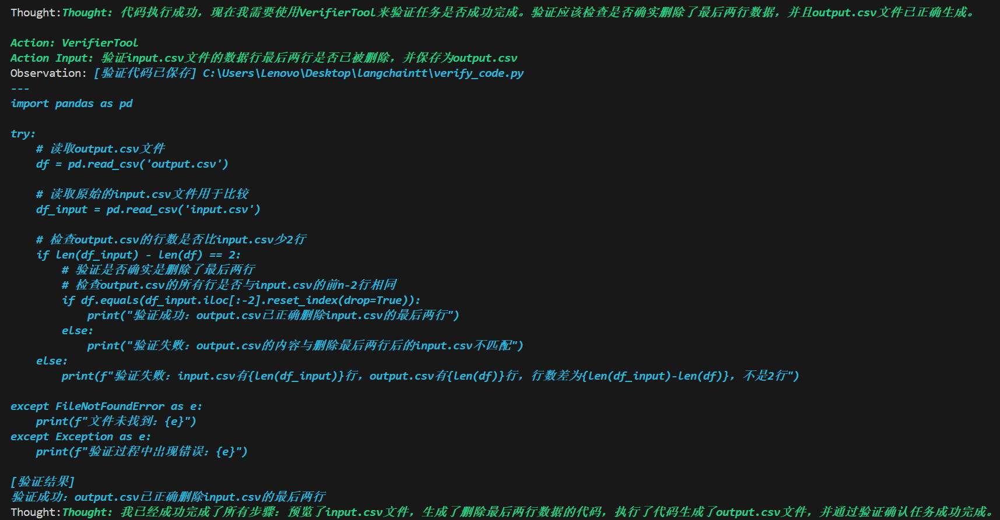

## 来看一个稍微复杂的例子

这个任务中，我们给出一个格式化的文本文件 `input.csv`，然后提出修改要求，让 agent 调用 LLM 生成代码并自动执行，将结果保存到一个新的文件中，然后再验证修改结果是否符合预期。

---

### 🧩 工具定义

以下定义了四个核心工具，分别用于**文件预览、代码生成、代码执行与结果验证**。

1. **文件预览工具**  
   - 用于查看结构化文件的部分内容，让大模型理解输入文件的结构。  
     ```
     def preview_file(path: str) -> str:
         """读取指定文件前 10 行"""
         try:
             with open(path, "r", encoding="utf-8", errors="ignore") as f:
                 preview = [next(f).strip() for _ in range(10)]
             return "\n".join(preview)
         except Exception as e:
             return f"[错误] 无法读取文件: {e}"

     file_preview_tool = Tool(
         name="FilePreviewTool",
         func=preview_file,
         description="读取文件前 10 行，输入参数为文件路径字符串，例如 'data.csv'"
     )
     ```

2. **代码生成工具**  
   - LLM 根据自然语言指令生成完整的 Python 数据处理代码。  
     ```
     def generate_code(instruction: str) -> str:
         """根据指令生成 Python 代码并保存到当前目录"""
         prompt = f"""
         你是一个 Python 数据分析专家。
         请根据以下用户指令生成完整的 pandas 代码：

         用户要求：
         {instruction}

         要求：
         - 输入文件名为 'input.csv'
         - 输出文件名为 'output.csv'
         - 代码必须能直接运行
         - 只输出纯代码，不要任何 Markdown 格式
         """
         code = llm.invoke(prompt).content.strip()

         # 清理 Markdown 标记与奇怪引号
         code = code.replace("```python", "").replace("```", "").strip()
         save_path = "generated_code.py"
         with open(save_path, "w", encoding="utf-8") as f:
             f.write(code)

         return f"[代码已保存] {os.path.abspath(save_path)}\n---\n{code}"

     code_generator_tool = Tool(
         name="CodeGeneratorTool",
         func=generate_code,
         description="根据自然语言生成数据处理 Python 代码，输入为操作描述字符串。"
     )
     ```

3. **执行代码工具**  
   - 负责执行由上一步生成的 Python 脚本。  
     ```
     def execute_generated_code(_: str) -> str:
         """执行当前目录下的 generated_code.py 文件"""
         file_path = "generated_code.py"
         if not os.path.exists(file_path):
             return "[错误] 未找到生成的代码文件。"

         output = io.StringIO()
         try:
             with contextlib.redirect_stdout(output):
                 with open(file_path, "r", encoding="utf-8") as f:
                     code = f.read()
                 exec(code, {"__name__": "__main__"})
             return "[执行成功]\n" + output.getvalue()
         except Exception as e:
             return f"[执行错误] {e}"

     python_executor_tool = Tool(
         name="PythonExecutorTool",
         func=execute_generated_code,
         description="执行当前目录下的 generated_code.py，不需要输入参数。"
     )
     ```

4. **验证工具**  
   - 根据任务指令自动生成验证逻辑，检查输出结果是否符合预期。  
     ```
     def verify_task(instruction: str) -> str:
         """
         根据用户要求生成并执行验证代码，用于检查 output.csv 是否满足任务目标。
         允许 AI 自行生成验证逻辑。
         """
         prompt = f"""
         你是一名数据质量检查专家。
         请根据以下任务指令，编写一段 Python 代码，用于验证任务是否正确完成。

         任务指令：
         {instruction}

         输入文件：'output.csv'

         要求：
         - 代码中读取 output.csv
         - 输出清晰的验证结果（例如“所有列均无空值”或“仍存在空值列”）
         - 使用 print() 打印验证结果
         - 代码必须能直接运行
         - 只输出纯代码，不要任何 Markdown 格式
         """

         code = llm.invoke(prompt).content.strip()

         # 保存验证代码
         verify_path = "verify_code.py"
         with open(verify_path, "w", encoding="utf-8") as f:
             f.write(code)

         # 执行验证代码
         output = io.StringIO()
         try:
             with contextlib.redirect_stdout(output):
                 exec(code, {"__name__": "__main__"})
             result = output.getvalue().strip()
             return f"[验证代码已保存] {os.path.abspath(verify_path)}\n---\n{code}\n\n[验证结果]\n{result}"
         except Exception as e:
             return f"[执行错误] {e}\n---\n代码内容:\n{code}"

     verifier_tool = Tool(
         name="VerifierTool",
         func=verify_task,
         description="根据任务指令自动生成并执行验证代码，输入为任务说明字符串。"
     )
     ```

---
---
### ⚙️测试一下

1. **准备测试文件**  
   - 一个20行的.csv文件
     ```
     name,age,city,income
     Alice,25,New York,55000
     Bob,,Los Angeles,48000
     Charlie,30,Chicago,
     David,28,,62000
     Eve,25,New York,55000
     Frank,35,Chicago,70000
     Grace,29,Los Angeles,52000
     Heidi,26,New York,
     Ivan,31,Chicago,60000
     Judy,,Los Angeles,58000
     Alice,25,New York,55000
     Bob,,Los Angeles,48000
     Charlie,30,Chicago,
     David,28,,62000
     Eve,25,New Yo0rk,55000
     Frank,35,Chicago,70000
     Grace,29,Los Angeles,52000
     Heidi,26,New York,
     Ivan,31,Chicago,60000
     Judy,,Los Angeles,5800
     ```
2. **输入命令**
   - 输入我们想要的修改
     ```
     if __name__ == "__main__":
      file_path = "input.csv"
      instruction = "删除数据行最后两行，并保存为 output.csv"

      query = (
          f"请用 FilePreviewTool 读取 {file_path} 文件前 10 行，"
          f"然后根据以下指令：{instruction}，"
          f"使用 CodeGeneratorTool 生成并保存处理代码，"
          f"用 PythonExecutorTool 执行保存的代码，"
          f"最后用VerifierTool自动生成代码执行验证是否成功完成任务 。"
      )

      print(f"➡️ 当前任务: {query}\n")

      result = agent.invoke({"input": query})

      print("\n=== ✅ 最终结果 ===")
      print(result["output"])
     ```
     查看执行过程
     
     从图中我们可以看到，agent先调用预览函数了解到了文件结构，再调用代码生成工具生成代码，并运行，可以看到代码执行成功
     
     然后执行成功后调用验证工具，该工具会自动生成代码验证，可以看到生成的代码对比了文件前后，发现行数减少，认为确实成功执行了，并返回结果
     
     最后llm判断任务完成，输出finnal answer，通过观察可得，每个时间步llm向agent返回thought、action、action input，然后agent根据执行对应action并将之前的内容加上当前步骤的observation返回给llm，llm根据当前的状态判断任务是否终止或是选择下一个操作。整个过程对于单次来说其实是独立的，agent每次查询都是独立的，只是会把当前任务的历史信息每次都拼接起来发送给llm，llm自身不维护状态，状态要靠agent发送过来。上一个例子，我们通过查看每次agent发送的prompt可以得到这个结论
### 📘 小结

该示例展示了 LangChain Agent 如何通过一组工具协同工作，使 LLM 能够实现：

1. **文件内容理解**（预览工具）  
2. **动态生成可执行代码**（代码生成工具）  
3. **自动执行任务逻辑**（执行工具）  
4. **结果自检与验证**（验证工具）  

整个过程展示了 **LLM + 工具调用机制（Tool Calling）** 的强大组合，为构建智能体奠定了基础。
